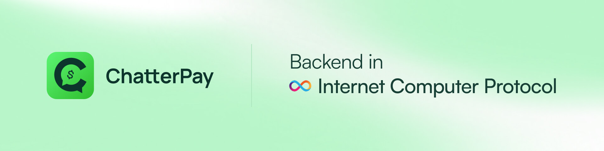
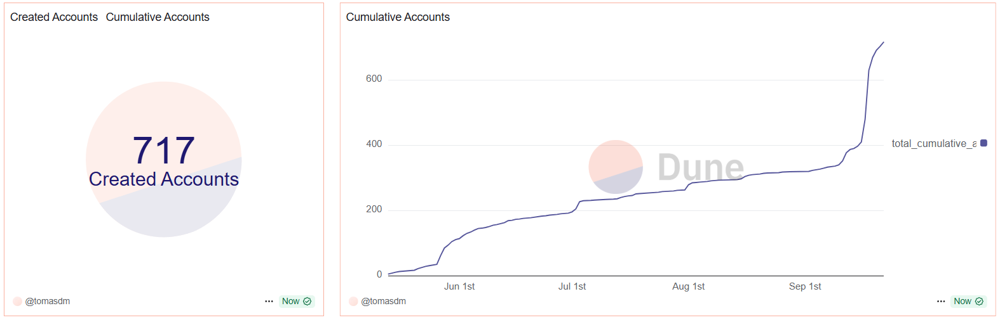
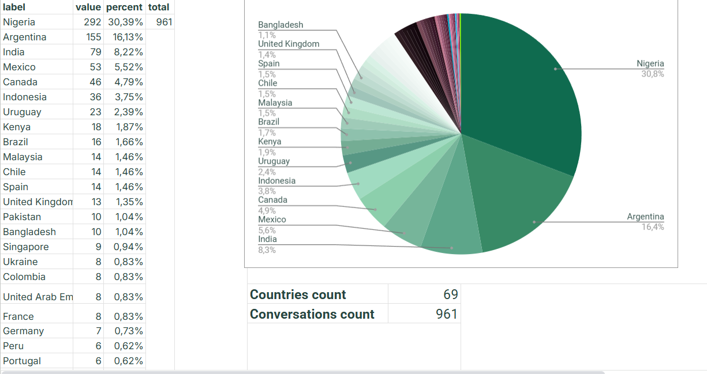
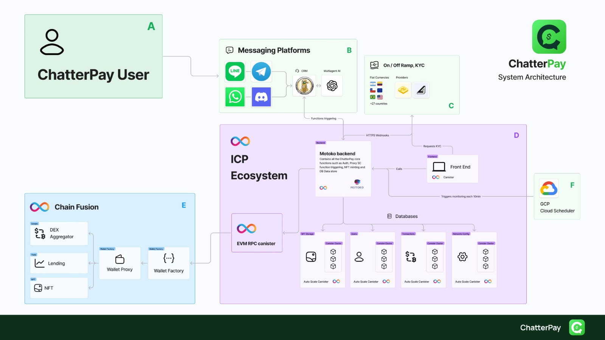
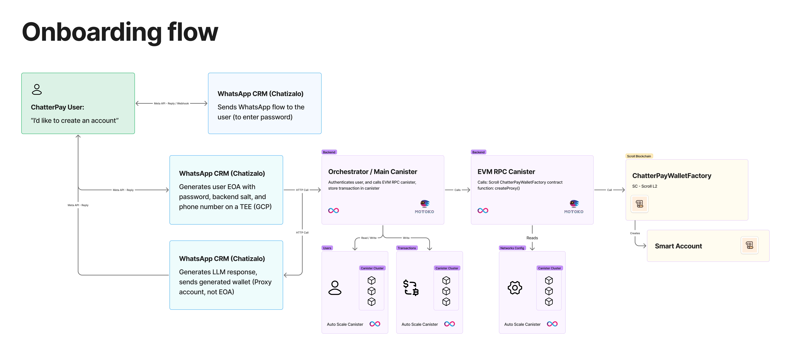

# ChatterPay ICP Backend


ChatterPay is a Wallet that allows anyone to send and receive crypto with WhatsApp messages. Enabling crypto for +2B WhatsApp users.

This repository contains the Internet Computer backend implementation using Motoko.

**Components**:

- Landing Page ([product](https://chatterpay.net), [source code](https://github.com/P4-Games/ChatterPay))
- User Dashboard Website ([product](https://chatterpay.net/dashboard), [source code](https://github.com/P4-Games/ChatterPay))
- Backend API (this Repo)
- Smart Contracts ([source code](https://github.com/P4-Games/ChatterPay-SmartContracts))
- Data Indexing (Subgraph) ([source code](https://github.com/P4-Games/ChatterPay-Subgraph))
- Bot AI Admin Dashboard Website ([product](https://app.chatizalo.com/))
- Bot AI (Chatizalo) ([product](https://chatizalo.com/))

# About this Repo

This repository contains the Internet Computer backend implementation using Motoko, providing a decentralized backend infrastructure for ChatterPay.

**Built With**:

- Platform: [Internet Computer](https://internetcomputer.org/)
- Language: [Motoko](https://internetcomputer.org/docs/current/motoko/main/motoko), [TypeScript](https://www.typescriptlang.org/)
- Development Framework: [DFX](https://internetcomputer.org/docs/current/developer-docs/build/install-upgrade-remove)
- Interface Description: [Candid](https://internetcomputer.org/docs/current/developer-docs/build/candid/candid-intro)

# Deployments

The ChatterPay backend is deployed on the Internet Computer mainnet with the following canister IDs:

| Service | Canister ID | IC URL |
|---------|-------------|---------|
| Analytics Service | `x34wm-pqaaa-aaaan-qz6za-cai` | https://x34wm-pqaaa-aaaan-qz6za-cai.ic0.app |
| Auth Service | `xo3hb-oyaaa-aaaan-qz62q-cai` | https://xo3hb-oyaaa-aaaan-qz62q-cai.ic0.app |
| Health Service | `wkwit-xyaaa-aaaan-qz64q-cai` | https://wkwit-xyaaa-aaaan-qz64q-cai.ic0.app |
| Last Processed Blocks | `weuf3-miaaa-aaaan-qz65q-cai` | https://weuf3-miaaa-aaaan-qz65q-cai.ic0.app |
| NFTs Storage | `wnxoh-2aaaa-aaaan-qz64a-cai` | https://wnxoh-2aaaa-aaaan-qz64a-cai.ic0.app |
| Tokens | `nb4jx-xiaaa-aaaah-arjsa-cai` | https://nb4jx-xiaaa-aaaah-arjsa-cai.ic0.app |

You can interact with each canister using the Candid interface by visiting the IC URLs above.

# Metrics & Analytics

## Project Growth


ChatterPay has demonstrated significant organic growth since its mainnet launch in May 2024:

- **720+ wallets** created on Scroll mainnet
- **69 countries**
- **700+ Discord community members**
- **200k+ social media impressions**
- **$0 advertising spend** - 100% organic growth
- **No new apps installed**

## Real-time Analytics Dashboard
Track ChatterPay's on-chain metrics and usage statistics:
- **[Dune Analytics Dashboard](https://dune.com/tomasdm/chatterpay-dashboard)** - Comprehensive on-chain data and transaction analytics

## Project Validation
The project's success validates market demand for crypto-enabled WhatsApp payments:
- Started at a Scroll hackathon in 2024 where we won several prizes
- Hackathon success provided initial funding to reach mainnet
- Launched mainnet in May 2025
- Achieved significant user adoption without paid marketing
- Strong community engagement across multiple platforms

These metrics demonstrate the product-market fit and growing demand for accessible crypto payments through familiar messaging platforms.

# Getting Started

**1. Install Requirements**:

- [DFX](https://internetcomputer.org/docs/current/developer-docs/build/install-upgrade-remove)
- [Node.js](https://nodejs.org/) (for development tools)
- [Git](https://git-scm.com/)

**2. Clone repository**:

```bash
git clone https://github.com/P4-Games/ChatterPay-ICP-Backend
cd ChatterPay-ICP-Backend
```

**3. Install DFX**:

```bash
sh -ci "$(curl -fsSL https://internetcomputer.org/install.sh)"
```

**4. Start Local Network**:

```bash
dfx start --background
```

**5. Deploy Canisters**:

```bash
dfx deploy
```

The backend will be available at the provided canister URLs.

# Project Structure

- `src/`:
  - `types.mo`: Shared type definitions
  - `transactions/`: Transaction management canister with analytics
  - `users/`: User management canister with security features
  - `blockchains/`: Blockchain configuration canister
  - `tokens/`: Token management canister
  - `nfts/`: NFT management canister with batch operations
  - `last_processed_blocks/`: Block processing tracking canister
  - `evm_service/`: EVM integration service with multi-chain support
  - `env/`: Environment configuration and constants
- `dfx.json`: Project configuration file
- `.gitignore`: Git ignore configuration
- `README.md`: This file

# Architecture



The ChatterPay ICP Backend follows a **unified two-tier microservices architecture**:

## Two-Tier Architecture Pattern

### Storage Layer (Motoko)
Core data persistence and CRUD operations with native ICP optimization:
- `users` - User profiles, authentication, rate limiting, audit logs
- `transactions` - Transaction records with multi-chain support
- `nfts` - NFT storage and ownership tracking
- `tokens` - Token metadata and configurations
- `blockchains` - Blockchain network configurations
- `last_processed_blocks` - Block synchronization tracking

### Service Layer (Azle/TypeScript)
Business logic, external integrations, and advanced features:
- `evm_service` - EVM blockchain interactions and multi-chain operations
- `analytics_service` - Analytics, metrics, and user insights
- `auth_service` - Authentication and JWT token management
- `health_service` - System health monitoring
- `external_apis` - Third-party API integrations
- `blockchain_service` - Multi-chain operations coordinator
- `database_proxy` - Database proxy and caching layer

This separation provides:
- ✅ **Clear separation of concerns** - Storage vs. business logic
- ✅ **Technology optimization** - Motoko for storage, TypeScript for complex logic
- ✅ **Scalability** - Independent canister scaling
- ✅ **Maintainability** - Easier to update and test individual layers

# Example ideal flows:
These would be the account creation and transfer flows we want to achieve in ICP, which allow us to minimize trust without leaving the WhatsApp interface.

## Onboarding:


## Transfer Flow:


# Canisters Overview

The backend follows a unified two-tier architecture with clear separation between storage and service layers:

## Storage Layer Canisters (Motoko)

1. **users** - UserStorage:
   - User profiles and authentication data
   - Wallet associations and phone number mapping
   - **Security**: Rate limiting (10 req/min), audit logging, security metrics
   - **Features**: Enhanced validation, duplicate prevention, audit trails

2. **transactions** - TransactionManager:
   - Transaction records with multi-chain support
   - Transaction status tracking and history
   - Advanced analytics and querying capabilities
   - **Features**: Transaction analytics, volume tracking, gas estimation
   - Supports Arbitrum, Polygon, BSC, Ethereum, and Scroll networks

3. **nfts** - NFTStorage:
   - NFT minting and management with batch operations
   - NFT metadata storage and validation
   - Ownership and transfer tracking
   - **Features**: Batch creation/updates, metadata validation, enhanced querying

4. **tokens** - TokenStorage:
   - Token information and metadata
   - Chain-specific token configurations
   - Token balance tracking

5. **blockchains** - BlockchainStorage:
   - Blockchain network configurations
   - Smart contract addresses
   - Network-specific settings

6. **last_processed_blocks** - LastProcessedBlockStorage:
   - Blockchain synchronization state
   - Processing checkpoints
   - Network-specific block tracking

## Service Layer Canisters (Azle/TypeScript)

7. **evm_service** - EVMService:
   - EVM blockchain integration
   - Multi-chain transaction execution
   - Gas estimation and chain management
   - Automatic provider management

8. **analytics_service** - AnalyticsService:
   - User analytics and metrics
   - Platform statistics
   - Event tracking and insights

9. **auth_service** - AuthService:
   - JWT token generation and validation
   - Session management
   - Authentication flows

10. **health_service** - HealthService:
    - System health monitoring
    - Canister status checks
    - Performance metrics

11. **external_apis** - ExternalAPIs:
    - Third-party API integrations
    - External service connections
    - API rate limiting and caching

12. **blockchain_service** - BlockchainService:
    - Multi-chain operations coordinator
    - Cross-chain transaction routing
    - Network management

13. **database_proxy** - DatabaseProxy:
    - Database proxy layer
    - Query optimization
    - Caching mechanisms

# API Documentation

Each canister exposes its API through Candid interfaces. Here are the main endpoints for each canister:

## Transactions
- `makeTransfer`: Execute multi-chain transfers with gas estimation
- `getTransaction`: Retrieve transaction by ID
- `getTransactionsByAddress`: Get transactions for a specific address
- `getAllTransactions`: List all transactions
- `getPendingTransactions`: Get pending transactions
- **Analytics APIs**:
  - `getTransactionCountByStatus`: Count transactions by status
  - `getTotalTransactionVolume`: Get total confirmed transaction volume
  - `getTransactionCountByAddress`: Count transactions for address
  - `estimateTransferGas`: Estimate gas costs for transfers

## Users
- `createUser`: Register a new user with validation
- `getUser`: Retrieve user information
- `getWalletByPhoneNumber`: Get wallet address by phone number
- `updateUser`: Update user information
- `deleteUser`: Remove user account
- **Security APIs**:
  - `getAuditLogs`: Get system audit logs
  - `getAuditLogsByCaller`: Get logs for specific caller
  - `getRateLimitStatus`: Check rate limit status
  - `getSecurityMetrics`: Get security metrics

## NFTs
- `createNFT`: Mint a new NFT with metadata validation
- `getNFT`: Retrieve NFT information
- `getNFTsByWallet`: Get NFTs owned by a wallet
- `updateNFTMetadata`: Update NFT metadata
- **Batch Operations**:
  - `batchCreateNFTs`: Create multiple NFTs in one operation
  - `batchUpdateMetadata`: Update multiple NFT metadata
  - `validateMetadata`: Validate NFT metadata
  - `getNFTCountByWallet`: Get NFT count for wallet

## EVM Service
- `transfer`: Execute cross-chain transfers
- `getTransactionStatus`: Check transaction status
- `validateAddress`: Validate Ethereum addresses
- **Multi-chain APIs**:
  - `estimateGas`: Estimate gas costs for transactions
  - `getSupportedChains`: Get list of supported blockchains
  - `getChainInfo`: Get information about specific chain

For complete API documentation, deploy the canisters and visit the Candid interface.

# Development

To start development:

1. Start local network:
```bash
dfx start --background
```

2. Deploy canisters:
```bash
dfx deploy
```

3. Test the API:
```bash
dfx canister call <canister_name> <method_name> '(<arguments>)'
```

# Contributing

1. Fork the repository
2. Create a feature branch
3. Commit your changes
4. Push to the branch
5. Create a Pull Request

# License

This project is licensed under the MIT License - see the LICENSE file for details.
